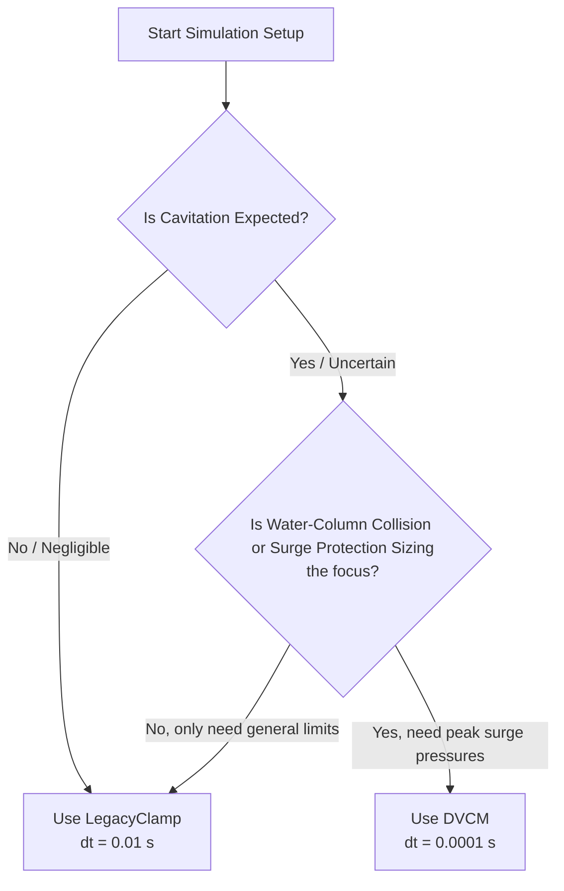

# Cavitation Model Comparison: Legacy Clamp vs. DVCM

This document provides a detailed comparison between the **Legacy Clamp** and the **Discrete Vapor Cavity Model (DVCM)** in RTHYM-MOC, focusing on their physical formulation, numerical behavior, and computational performance.

---

## 1. Physical & Theoretical Formulation

| Aspect | `LegacyClamp` Mode | `DVCM` Mode |
|---|---|---|
| **Governing Equations** | Standard MOC hydraulic equations | MOC + regime-switching vapor pocket equations |
| **Cavitation Initiation** | Starts when local node head drops below $H_{\text{vap}}$ | Starts when local node head drops below $H_{\text{vap}}$ |
| **Vapor Volume Integration** | None (no cavity state stored) | $$V_c(t) = \int (Q_{\text{out}} - Q_{\text{in}}) \, dt$$ |
| **Regime Switching** | Simple clamping of head value | Dynamic tracking: Liquid-Full $\leftrightarrow$ Cavity-Active |
| **Collapse Pressure Spike** | Missing (no physical water-column collision) | Fully resolved: $\Delta H \approx a \cdot \Delta V / (2 g A)$ |
| **Wave Reflection Behavior** | Partially damped waves | Complex high-frequency reflection wave patterns |

### Legacy Clamp Behavior
The legacy clamp acts as a rigid numerical boundary condition that prevents HGL heads from falling below the vapor pressure floor. While this floor is a practical safeguard that prevents non-physical negative pressures in general simulations, it lacks the physical mechanism to represent:
- **Vapor pocket growth**: The volume of the vapor region is not tracked.
- **Water-column separation**: The liquid columns on either side of the vapor region do not separate in space.
- **Secondary water hammer**: The subsequent collapse and collision of these columns is ignored, missing the severe secondary overpressures that typically dominate cavitation design failures.

### DVCM Behavior
The DVCM represents the physics of localized column separation. When local pressure reaches the vapor limit, the node transitions into a vapor boundary. The two water columns on either side are free to move independently, and the volume of the vapor pocket is integrated over time.
When the surrounding hydraulic waves reverse and force the columns back together, the pocket volume decreases to zero. At the step of complete collapse, the water columns collide, creating a sharp, high-intensity secondary pressure spike (water hammer) that propagates through the network.

---

## 2. Numerical Stability & Timestep Sensitivity

### Legacy Clamp
* **Stability**: Extremely high. Because it is a simple mathematical clamp, it does not suffer from integration drift or regime oscillations.
* **Timestep Requirement**: Can run stably with coarse timesteps (e.g., $dt = 0.01\text{ s}$ to $0.05\text{ s}$), making it ideal for rapid screening or very long simulations.

### DVCM
* **Stability**: High sensitivity. The step-by-step integration of cavity volume $V_c$ is highly dependent on the grid density.
* **Timestep Requirement**: Typically requires $dt \le 0.001\text{ s}$ (often $0.0001\text{ s}$ or smaller for high-intensity transients). 
* **Instability Risk**: If the timestep $dt$ is too coarse relative to the transient velocity, the volume integration can overshoot, resulting in non-physical negative volumes or sudden mathematical instabilities (`NaN`/`Inf` propagation).

---

## 3. Computational Cost & Performance

There are two ways to measure the computational cost: **per-step execution time** and **overall run time**.

### A. Per-Step Execution Time (Direct Solver Overhead)
Surprisingly, **DVCM is ~22% faster per step than Legacy Clamp**.
* **Legacy Clamp**: After completing the main hydraulic calculations in `stepMOC()`, the solver runs a secondary post-step loop over every node in the network to check pressure thresholds, update legacy scaffolding variables, and write cavitation telemetry. This post-step pass adds measurable overhead.
* **DVCM**: The cavity volume integration, regime switches, and state updates are computed directly inside the primary hydraulics switch-block of `stepMOC()` (during the main matrix/equation solve). The post-step pass is skipped entirely via a short-circuit, leading to a net reduction in per-step CPU cycles.

### B. Overall Simulation Run Time
Because the physics of DVCM require a smaller timestep to ensure numerical stability during cavity collapse, the total number of steps in a simulation run increases:
* A standard 10-second simulation using `LegacyClamp` at $dt = 0.01\text{ s}$ requires **1,000 steps** (takes ~2 ms).
* The same simulation using `DVCM` at a stable $dt = 0.0001\text{ s}$ requires **100,000 steps** (takes ~150 ms).

Therefore, while the DVCM code is highly optimized, the overall computational cost of a DVCM run is higher due to the finer grid resolution required.

---

## 4. Decision Matrix: Choosing the Right Model

Use the following guidelines to select the appropriate cavitation model for your study:



### Use `LegacyClamp` when:
1. Running large-scale networks where transient pressures stay safely above vapor pressure.
2. Performing rapid initial design iterations where simulation speed is prioritized over physical detail.
3. Importing huge EPANET models with short pipe segments that would require extremely small timesteps to satisfy the Courant condition.

### Use `DVCM` when:
1. Simulating rapid pump trips or sudden valve closures where column separation is likely.
2. Sizing and validating passive surge protection devices (such as air valves or hydropneumatic vessels) under severe subatmospheric exposure.
3. Conducting safety and structural integrity audits to calculate the absolute peak overpressure from water column collision.

---

## 5. Junction-Only DVCM vs. Interior DVCM (Long-Pipeline Phase 3)

RTHYM-MOC ships two DVCM scopes on uninterrupted pipe reaches:

| Aspect | Junction-only DVCM (default) | Interior DVCM (`enable_interior_dvcm=True`) |
|---|---|---|
| **Activation** | `CavitationModel.DVCM` only | `CavitationModel.DVCM` **and** `enable_interior_dvcm=True` on `run()` |
| **State location** | `NodeState` at graph junctions, valves, pumps, and inline devices | `PipeSegmentState` per MOC grid index `j = 1 … N-2` |
| **Cavity capacity** | Sum of adjacent pipe-half volumes at the node | Segment volume $dx \cdot A$ at each interior grid point |
| **Vapor head reference** | Node `elevation` | Local survey elevation $z(x)$ via `pipeGridVaporHeadFt()` |
| **Interior MOC heads** | Not clamped; may fall below local $H_{\text{vap}}(x)$ on sloping reaches | Clamped to local vapor head while cavity regime is active |
| **Profile diagnostics** | `pipe_profile_cavitation` only (0/1 screening from gauge pressure) | Adds `pipe_profile_cavity_volume`, `pipe_profile_cavity_active` |
| **Backward compatibility** | Unchanged — this is the default when interior mode is off | Opt-in; junction telemetry and flat-network tests are unaffected |

### Junction-only behavior on sloping uninterrupted pipes

Before Phase 3, `CavitationModel.DVCM` applied regime switching only at **network nodes** (junctions, valves, pumps, etc.). On a junction-free sloping main:

- Interior MOC predictor heads/velocities are computed each step but **not** integrated into a vapor-pocket state machine.
- Profile gauge pressure can dip below the local vapor limit at terrain high points even though junction boundaries remain physical.
- `pipe_profile_cavitation` flags sub-vapor **screening** from instantaneous gauge pressure, but there is no `pipe_profile_cavity_volume` growth or collapse spike at mid-pipe chainage.

This is intentional for backward compatibility: existing junction DVCM regression suites and EPANET-style networks with frequent nodes behave as before.

### Interior DVCM behavior on sloping uninterrupted pipes

When `enable_interior_dvcm=True`, the same `LiquidFull → CavityActive → CollapseTransition` regime machine runs in the interior MOC loop immediately after the C± predictor step:

1. **Cavity initiation** uses local $H_{\text{vap}}(x)$ and the same enter/leave hysteresis as junction DVCM (`0.10` / `0.50` psi ft tolerances).
2. **Volume growth** is bounded per step to $0.25 \times dx \cdot A$ from segment conductance imbalance.
3. **Head clamp** holds $H_j \ge H_{\text{vap}}(x_j)$ while the segment regime is not `LiquidFull`.
4. **Collapse** shrinks stored volume; the committed head profile can show a secondary rise at the survey summit (water-column collision) detectable on `pipe_profile_head`.

Pipe-end grid indices (`j = 0`, `j = N-1`) remain governed by boundary/junction DVCM at the graph nodes; interior state is not written there.

### Side-by-side on a downsurge sloping main

Canonical geometry: 2000 ft pipe, survey summit at 1000 ft chainage, downstream reservoir drop. Documented tests in `tests/test_interior_dvcm_sloping_pipe.py`:

| Observation | Junction-only DVCM | Interior DVCM |
|---|---|---|
| Cavity volume at pipe terminals (profile export) | Not exported; endpoints inactive | Still zero — only interior indices carry state |
| Cavity at survey summit | No tracked volume | `pipe_profile_cavity_active` and `pipe_profile_cavity_volume` grow at the high point |
| Summit head during separation | Can remain below local $H_{\text{vap}}$ | Clamped to local vapor floor while cavity is active |
| Post-collapse spike at summit | No mid-pipe collision physics | Detectable head rise ($\ge 5$ ft in reference case) localized near summit chainage |
| `dt` convergence | N/A for interior envelopes | Halving `dt` changes interior chainage envelopes by $< 1\%$ (see [dvcm_timestep_guidance.md §5](dvcm_timestep_guidance.md)) |

### API example

```python
results = solver.run(
    total_time=1.0,
    dt=0.001,
    cavitation_model=rthym_moc.CavitationModel.DVCM,
    record_pipe_profiles=True,
    enable_interior_dvcm=True,  # default False
)
# Interior diagnostics (when both flags are True):
#   results["pipe_profile_cavity_volume"]["P1"]  # ft³, shape (steps, profile_points)
#   results["pipe_profile_cavity_active"]["P1"]  # 0/1
```

`set_enable_interior_dvcm(True)` persists on the solver for subsequent `run()` calls. SI conversion via `results_to_si()` maps volume to `pipe_profile_cavity_volume_m3`.

### When to enable interior DVCM

Enable interior DVCM when:

1. Simulating **long, junction-free reaches** with elevation surveys where the terrain high point controls vapor margin.
2. Exporting **chainage-resolved cavity diagnostics** for R-THYM or long-line design review.
3. Resolving **mid-pipe column separation and collapse spikes** that junction-only DVCM cannot represent on uninterrupted pipes.

Keep junction-only DVCM (default) when:

1. The network has frequent nodes and column separation is already captured at junctions/valves.
2. You need fastest compatibility with existing DVCM regression baselines and do not need mid-pipe cavity state.
3. You are running flat networks where interior and junction behavior are equivalent for practical purposes.
