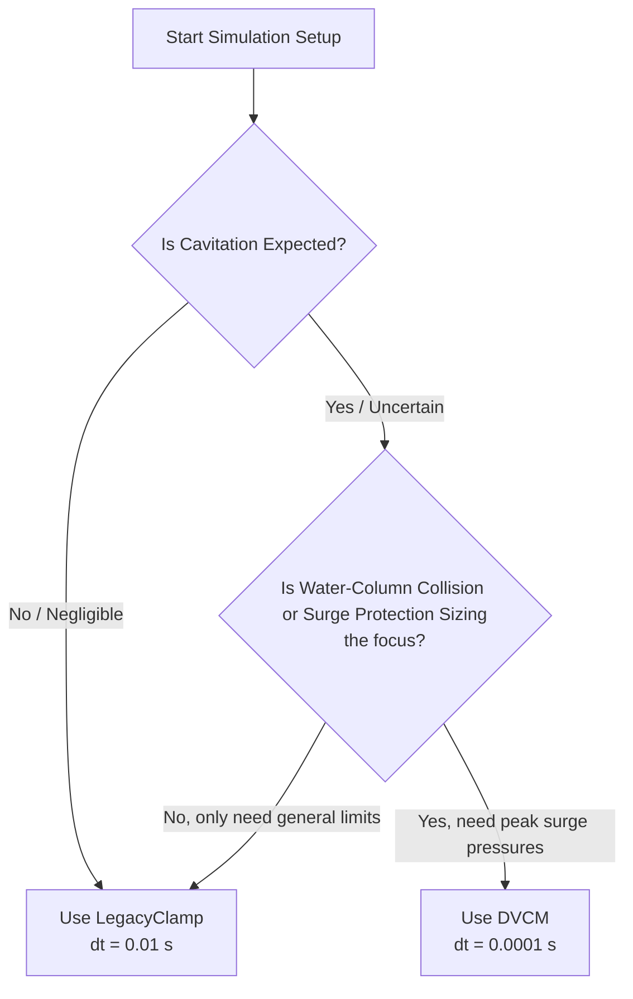

# Cavitation Model Comparison: Legacy Clamp vs. DVCM

This document provides a detailed comparison between the **Legacy Clamp** and the **Discrete Vapor Cavity Model (DVCM)** in RTHYM-MOC, focusing on their physical formulation, numerical behavior, and computational performance.

---

## 1. Physical & Theoretical Formulation

| Aspect | `LegacyClamp` Mode | `DVCM` Mode |
|---|---|---|
| **Governing Equations** | Standard MOC hydraulic equations | MOC + regime-switching vapor pocket equations |
| **Cavitation Initiation** | Starts when local node head drops below $H_{\text{vap}}$ | Starts when local node head drops below $H_{\text{vap}}$ |
| **Vapor Volume Integration** | None (no cavity state stored) | $$V_c(t) = \int (Q_{\text{out}} - Q_{\text{in}}) \, dt$$ |
| **Regime Switching** | Simple clamping of head value | Dynamic tracking: Liquid-Full $\leftrightarrow$ Cavity-Active |
| **Collapse Pressure Spike** | Missing (no physical water-column collision) | Fully resolved: $\Delta H \approx a \cdot \Delta V / (2 g A)$ |
| **Wave Reflection Behavior** | Partially damped waves | Complex high-frequency reflection wave patterns |

### Legacy Clamp Behavior
The legacy clamp acts as a rigid numerical boundary condition that prevents HGL heads from falling below the vapor pressure floor. While this floor is a practical safeguard that prevents non-physical negative pressures in general simulations, it lacks the physical mechanism to represent:
- **Vapor pocket growth**: The volume of the vapor region is not tracked.
- **Water-column separation**: The liquid columns on either side of the vapor region do not separate in space.
- **Secondary water hammer**: The subsequent collapse and collision of these columns is ignored, missing the severe secondary overpressures that typically dominate cavitation design failures.

### DVCM Behavior
The DVCM represents the physics of localized column separation. When local pressure reaches the vapor limit, the node transitions into a vapor boundary. The two water columns on either side are free to move independently, and the volume of the vapor pocket is integrated over time.
When the surrounding hydraulic waves reverse and force the columns back together, the pocket volume decreases to zero. At the step of complete collapse, the water columns collide, creating a sharp, high-intensity secondary pressure spike (water hammer) that propagates through the network.

---

## 2. Numerical Stability & Timestep Sensitivity

### Legacy Clamp
* **Stability**: Extremely high. Because it is a simple mathematical clamp, it does not suffer from integration drift or regime oscillations.
* **Timestep Requirement**: Can run stably with coarse timesteps (e.g., $dt = 0.01\text{ s}$ to $0.05\text{ s}$), making it ideal for rapid screening or very long simulations.

### DVCM
* **Stability**: High sensitivity. The step-by-step integration of cavity volume $V_c$ is highly dependent on the grid density.
* **Timestep Requirement**: Typically requires $dt \le 0.001\text{ s}$ (often $0.0001\text{ s}$ or smaller for high-intensity transients). 
* **Instability Risk**: If the timestep $dt$ is too coarse relative to the transient velocity, the volume integration can overshoot, resulting in non-physical negative volumes or sudden mathematical instabilities (`NaN`/`Inf` propagation).

---

## 3. Computational Cost & Performance

There are two ways to measure the computational cost: **per-step execution time** and **overall run time**.

### A. Per-Step Execution Time (Direct Solver Overhead)
Surprisingly, **DVCM is ~22% faster per step than Legacy Clamp**.
* **Legacy Clamp**: After completing the main hydraulic calculations in `stepMOC()`, the solver runs a secondary post-step loop over every node in the network to check pressure thresholds, update legacy scaffolding variables, and write cavitation telemetry. This post-step pass adds measurable overhead.
* **DVCM**: The cavity volume integration, regime switches, and state updates are computed directly inside the primary hydraulics switch-block of `stepMOC()` (during the main matrix/equation solve). The post-step pass is skipped entirely via a short-circuit, leading to a net reduction in per-step CPU cycles.

### B. Overall Simulation Run Time
Because the physics of DVCM require a smaller timestep to ensure numerical stability during cavity collapse, the total number of steps in a simulation run increases:
* A standard 10-second simulation using `LegacyClamp` at $dt = 0.01\text{ s}$ requires **1,000 steps** (takes ~2 ms).
* The same simulation using `DVCM` at a stable $dt = 0.0001\text{ s}$ requires **100,000 steps** (takes ~150 ms).

Therefore, while the DVCM code is highly optimized, the overall computational cost of a DVCM run is higher due to the finer grid resolution required.

---

## 4. Decision Matrix: Choosing the Right Model

Use the following guidelines to select the appropriate cavitation model for your study:

### Use `LegacyClamp` when:
1. Running large-scale networks where transient pressures stay safely above vapor pressure.
2. Performing rapid initial design iterations where simulation speed is prioritized over physical detail.
3. Importing huge EPANET models with short pipe segments that would require extremely small timesteps to satisfy the Courant condition.

### Use `DVCM` when:
1. Simulating rapid pump trips or sudden valve closures where column separation is likely.
2. Sizing and validating passive surge protection devices (such as air valves or hydropneumatic vessels) under severe subatmospheric exposure.
3. Conducting safety and structural integrity audits to calculate the absolute peak overpressure from water column collision.
