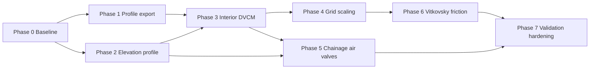

# Long Pipeline Surge — Implementation Roadmap

This document is a staged plan for improving RTHYM-MOC's ability to model
**long transmission pipelines** (multi-mile uninterrupted reaches, terrain-driven
summit cavitation, multi-period wave reflections). It complements the completed
[DVCM roadmap](dvcm_roadmap.md), which focused on junction-level column
separation.

The R-THYM web application already provides GUI, scenario management, and
visualization. This roadmap covers **solver/engine work only**.

**Tracking epic:** [GitHub #79](https://github.com/jlillywh/RTHYM-MOC/issues/79)
(phase child issues [#80](https://github.com/jlillywh/RTHYM-MOC/issues/80)–[#87](https://github.com/jlillywh/RTHYM-MOC/issues/87)).

---

## Problem statement

Long raw-water and transmission lines differ from short pump-station force mains:

| Concern | Why it matters |
|--------|----------------|
| **Mid-reach extrema** | Worst minimum (or maximum) pressure often occurs between physical junctions on a 10–50 mile run. |
| **Terrain-driven cavitation** | Column separation starts at **high points** along the elevation profile, not necessarily at terminals or block valves. |
| **Multi-period damping** | Friction and unsteady-friction errors accumulate over many wave reflections spanning minutes. |
| **Grid cost** | `N = round(L / (a·dt))` grows quickly on long pipes, especially with DVCM timesteps. |

### Current engine limitations (baseline)

1. **Results are node-centric** — interior MOC heads/velocities are computed each
   step but not exported; `run()` returns node heads and pipe-end flows only.
2. **Elevation is node-only** — a long pipe between two terminals is hydraulically
   flat; interior high points are invisible to vapor-head logic.
3. **DVCM is junction-only** — cavity regime switching applies at network nodes,
   not at interior grid points along an uninterrupted reach.
4. **No grid-scaling policy** — segment count is fully determined by `L`, `a`,
   and user-chosen `dt`; long pipes at fine `dt` can become impractical.
5. **Friction mode is fixed** — Brunone / Vardy–Brown IIR filter only; no
   explicit quasi-steady or Vitkovsky selector for damping-sensitive studies.

Existing coverage (`test_long_pipe_valve.py`, 3,500 ft with junctions every
1,000 ft) exercises wave travel and valve closure but does **not** validate
true long-line physics (summit separation, mid-pipe envelopes, grid scaling).

---

## Goals

- Export and interpret pressure/head **along the line**, not only at graph nodes.
- Represent **terrain** so vapor limits and air-valve placement follow elevation.
- Model **column separation at interior MOC points** on uninterrupted reaches.
- Keep long-pipe studies **computationally tractable** with documented accuracy
  tradeoffs.
- Improve **multi-period damping** fidelity for transmission-line envelope decay.
- Preserve backward compatibility: existing networks and tests unchanged unless
  new features are explicitly enabled.

## Non-goals (initial rollout)

- Dedicated SAV/SRV, rupture disk, pump bypass, and specialized tank element
  libraries (see [Tier 3](#tier-3--optional-later) below).
- Distributed two-phase / entrained-gas flow in the pipe interior (DGCM).
- Transient force computation for pipe supports (downstream of pressure envelope).
- Automatic GIS import of elevation profiles (manual/API tables first).
- Changing the default cavitation model or default `dt`.

## Delivery strategy

Phased delivery with explicit exit criteria, same pattern as
[dvcm_roadmap.md](dvcm_roadmap.md). Each phase should land with targeted tests
before the next phase begins. Phases 1–2 can proceed in parallel after a short
Phase 0 baseline; Phase 3 depends on Phases 1–2.



---

## Phase 0: Baseline and Governance

### Deliverables

- Document current long-pipe behavior and known gaps (this file).
- Define acceptance metrics and performance budgets for long-line cases.
- Identify code touchpoints before implementation begins.

### Checklist

- [x] Record baseline: interior `H[j]`/`V[j]` exist in `stepMOC()` but are not in
      `SimResults` (`src/solver/moc_solver.hpp`, `bindings/python/bindings.cpp`). See
      [long_pipeline_phase0_baseline.md](long_pipeline_phase0_baseline.md) §1.
- [x] Record baseline: vapor head uses node `elevation` only (`src/solver/moc_solver.cpp`,
      junction/DVCM branches). See
      [long_pipeline_phase0_baseline.md](long_pipeline_phase0_baseline.md) §2.
- [x] Record baseline: segment count formula and wave-speed adjustment
      (`initGrid()` in `src/solver/moc_solver.cpp`). See
      [long_pipeline_phase0_baseline.md](long_pipeline_phase0_baseline.md) §3.
- [x] Define performance budget (reference case `LP-PERF-01`): 20-mile single
      pipe, `dt = 0.001 s`, 60 s simulated time, **&lt; 30 s** wall clock on a
      typical dev laptop with `max_segments_per_pipe ≤ 2000` (Phase 4). See
      [long_pipeline_phase0_baseline.md](long_pipeline_phase0_baseline.md) §4;
      calibrate with `scripts/benchmark_long_pipeline_budget.py`.
- [x] Create tracking issue/epic linked to this roadmap. Epic:
      https://github.com/jlillywh/RTHYM-MOC/issues/79 (phases #80–#87).

### Exit criteria

- Baseline notes committed; team agrees on phase order and non-goals.

### Code touchpoints (reference)

| Area | Files |
|------|-------|
| Interior MOC loop | `src/solver/moc_solver.cpp` (~interior nodes `j = 1 … N-2`) |
| DVCM regime logic | `src/solver/moc_solver.cpp` (junction/valve/pump branches) |
| Results schema | `src/solver/moc_solver.hpp` (`SimResults`), `bindings/python/bindings.cpp` |
| Grid setup | `src/solver/moc_solver.cpp` (`initGrid`, Courant adjustment) |
| Study reports | `rthym_moc/report.py` |
| WASM bindings | `bindings/wasm/wasm_bindings.cpp` (update when schema grows) |

---

## Phase 1: Pipe Profile Export (Tier 1)

**Status:** Complete — [#81](https://github.com/jlillywh/RTHYM-MOC/issues/81),
[#88](https://github.com/jlillywh/RTHYM-MOC/pull/88).

**Priority:** Highest — immediate value for R-THYM visualization; no new physics.

### Deliverables

- Optional interior-point time series: head, pressure, and optionally velocity
  along each pipe.
- Chainage metadata (distance from upstream end) for each profile sample.
- Study-report helpers for line envelopes (min/max head vs chainage).

### Proposed API (draft)

```python
# run() gains optional flag or separate method:
results = solver.run(..., record_pipe_profiles=True)

# New results keys (US customary):
results["pipe_profile_chainage_ft"]["P1"]   # (N_seg,) distances from from_node
results["pipe_profile_head"]["P1"]          # (N_seg, N_time) or list per segment
results["pipe_profile_pressure"]["P1"]      # gauge psi using interpolated elevation
results["pipe_profile_velocity_fps"]["P1"]  # optional

# Downsampled export for web app payload size:
results = solver.run(..., record_pipe_profiles=True, profile_stride=4)
```

### Checklist

- [x] Extend `SimResults` with profile arrays per pipe.
- [x] Populate profiles in `recordStep()` from `pipes_[i].H[j]` / `V[j]`.
- [x] Expose via pybind11 (`bindings.cpp`) and `_rthym_moc.pyi`.
- [x] Add SI helpers in `rthym_moc/units.py` (`pipe_profile_head_m`, etc.).
- [x] Extend `summarize_study()` with per-pipe chainage envelope (min/max vs x).
- [x] Add `tests/test_pipe_profile_export.py` on a known MOC grid (compare
      interior point to analytical Joukowsky at midpoint).
- [x] Document new keys in `README.md` Results dictionary section.
- [x] Update `docs/dvcm_web_integration.md` if R-THYM consumes new fields.

### Exit criteria

- [x] Profile export is opt-in; legacy `run()` output unchanged when flag is false
      (`test_profile_export_disabled_by_default`).
- [x] Mid-pipe head on a single-pipe Joukowsky case matches analytical within
      existing project tolerances (`test_midpipe_head_matches_joukowsky_after_downstream_closure`,
      ±5 ft, solver-adjusted wave speed, frictionless run).
- [x] No measurable slowdown (&lt; 5%) when profile export is disabled
      (`tests/test_long_pipeline_perf.py` vs `tests/long_pipeline_perf_baseline.json`, `pytest -m slow`).

---

## Phase 2: Elevation Profile Along Pipes (Tier 1)

**Status:** Complete — [#82](https://github.com/jlillywh/RTHYM-MOC/issues/82) (pending PR merge).

**Priority:** High — unlocks correct vapor limits at interior high points.

### Deliverables

- Per-pipe elevation at each MOC grid point.
- Vapor head `H_vap(x) = z(x) + H_vapor` used for cavitation checks and profile
  pressure conversion at interior points.
- Support for piecewise-linear survey tables in addition to endpoint interpolation.

### Proposed API (draft)

```python
pipe = rthym_moc.PipeInput(...)
# Default: linear between from_node and to_node elevations (zero new fields).

# Optional survey override (chainage ft from from_node, elevation ft):
pipe.elevation_profile = [(0.0, 120.0), (26400.0, 340.0), (52800.0, 95.0)]

# SI helper:
pipe_si(..., elevation_profile_m=[(0.0, 36.6), ...])
```

### Checklist

- [x] Add `elevation_profile` to `PipeInput` (empty → linear interpolation).
- [x] Interpolate `z[j]` at each interior grid point during `initGrid()`.
- [x] Store `z[j]` per pipe segment in `PipeState`.
- [x] Use `z[j]` when computing gauge pressure for profile export.
- [x] Use `z[j]` for **LegacyClamp** at interior points (see Phase 3) and for
      pre-DVCM vapor screening tests (`pipe_profile_cavitation`, interior clamp in `stepMOC()`).
- [x] EPANET import: optional `[RTHYM]` elevation table per pipe (`PipeElevation` rows).
- [x] Add `tests/test_pipe_elevation_profile.py`:
      - [x] Summit elevation produces lowest static pressure at correct chainage.
      - [x] Linear fallback matches current behavior for two-node pipes.
- [x] Document in README `PipeInput` section and this roadmap.

### Exit criteria

- [x] Sloping pipe without junctions: minimum **static** gauge pressure occurs at the
      survey high point (before transient)
      (`test_static_gauge_pressure_minimum_at_survey_summit`).
- [x] Existing flat-network tests unchanged (full regression suite; interior clamp
      gated to terrain reaches).
- [x] Profile pressure uses local elevation, not endpoint elevation
      (`test_survey_elevation_profile_overrides_linear_interpolation`,
      `test_profile_cavitation_screening_matches_local_vapor_head`).

---

## Phase 3: Interior-Point DVCM (Tier 1)

**Status:** Complete — [#83](https://github.com/jlillywh/RTHYM-MOC/issues/83) (pending PR merge).

**Priority:** High — core physics fix for mid-pipe column separation.

### Deliverables

- Extend DVCM regime logic to interior MOC grid points (`j = 1 … N-2`).
- Cavity volume state per interior point (or sparse subset — see Phase 4).
- Profile export includes cavity diagnostics along the line.

### Design notes

- Reuse existing regime machine: `LiquidFull` → `CavityActive` →
  `CollapseTransition` (see `CavityRegime` in `moc_solver.hpp`).
- At interior points, continuity uses segment volumes derived from `dx` and
  `pipe.area` rather than junction pipe-half volumes.
- Collapse pressure spike: same `ΔH ≈ a·ΔV / (2gA)` formulation as junction DVCM.
- **Default:** interior DVCM off; enable via solver flag
  `enable_interior_dvcm=True` or extend `CavitationModel` policy.
- Keep junction DVCM behavior identical when interior mode is off.

### Checklist

- [x] Add `PipeSegmentState` (or extend `PipeState`) for cavity volume, regime,
      collapse counters per interior index (`PipeState.segments[j]`, initialized in
      `initGrid()`).
- [x] Implement regime switching in the interior loop after MOC predictor step
      (`stepInteriorSegmentDvcm()` in `stepMOC()`, segment capacity `dx·A`).
- [x] Add hysteresis tolerances (`H_CAVITY_ENTER_TOL`, `H_CAVITY_LEAVE_TOL`) —
      same as junction DVCM (shared `0.10` / `0.50` psi ft equivalents).
- [x] Wire optional interior DVCM flag on `MOCSolver` / `run()`
      (`enable_interior_dvcm`, default off).
- [x] Export `pipe_profile_cavity_volume`, `pipe_profile_cavity_active` when
      profiles enabled and `enable_interior_dvcm=True`.
- [x] Guard NaN/Inf paths (extend existing DVCM guards: `throwIfInvalidInteriorSegmentState`
      in `stepMOC()` and `recordStep()` for interior head, velocity, and cavity volume).
- [x] Add `tests/test_interior_dvcm_sloping_pipe.py`:
      - [x] Cavity initiates at summit under downsurge, not at terminals.
      - [x] Collapse produces secondary spike detectable at mid-pipe profile.
- [x] Add convergence test: halve `dt`, peak envelope within 1% (document in
      [dvcm_timestep_guidance.md](dvcm_timestep_guidance.md) §5 long-pipe section;
      `test_interior_dvcm_dt_halving_chainage_envelope_converges`).
- [x] Update [dvcm_comparison.md](dvcm_comparison.md) with interior vs junction-only
      behavior (§5).

### Exit criteria

- [x] Junction-only DVCM tests still pass with interior mode off
      (`test_interior_dvcm_off_matches_junction_only_dvcm_regression`, full suite).
- [x] Sloping long pipe (no intermediate junctions): cavity forms at high-point
      chainage in downsurge event (`test_interior_cavity_initiates_at_summit_not_terminals`).
- [x] No regression in `pytest -q` legacy/DVCM junction suite (403 passed; 53 `-m dvcm`).

---

## Phase 4: Grid Scaling for Long Reaches (Tier 2)

**Status:** Complete — [#84](https://github.com/jlillywh/RTHYM-MOC/issues/84) (pending PR merge).

**Priority:** Medium–high — makes Phase 3 practical on 10+ mile pipes.

### Deliverables

- User-facing controls to cap grid density with documented wave-speed distortion.
- Optional **sparse interior DVCM** — full MOC wave grid, cavity state only at
  flagged chainages (high points, user watchpoints).
- Timestep / segment distortion report in `summarize_study()` meta.

### Proposed API (draft)

```python
solver.set_grid_policy(
    max_segments_per_pipe=2000,   # cap N; adjust a_wave per existing Courant logic
    max_wave_speed_distortion=0.15,  # warn/error if |a' - a| / a exceeds this
)

# Sparse DVCM watchpoints (chainage ft from from_node):
pipe.interior_dvcm_chainages_ft = [13200.0, 39600.0]  # e.g. summit + user points
```

### Checklist

- [x] Implement `max_segments_per_pipe` in `initGrid()` (minimum 2 segments).
- [x] Emit per-pipe `wave_speed_design_fps`, `wave_speed_adjusted_fps`,
      `distortion_pct` in study meta.
- [x] Warn or fail when distortion exceeds threshold (configurable).
- [x] Implement sparse interior DVCM at listed chainages (snap to nearest grid
      index).
- [x] Performance benchmark: `LP-PERF-01` via `scripts/benchmark_long_pipeline_budget.py`
      (see [long_pipeline_phase0_baseline.md](long_pipeline_phase0_baseline.md) §4).
- [x] Document tradeoffs in new section of [dvcm_timestep_guidance.md](dvcm_timestep_guidance.md).
- [x] Add `tests/test_grid_scaling_long_pipe.py`.

### Exit criteria

- [x] `LP-PERF-01` completes in **&lt; 30 s** with `max_segments_per_pipe ≤ 2000`
      (baseline §4; `tests/test_long_pipeline_perf.py`, `scripts/benchmark_long_pipeline_budget.py`).
- [x] Distortion report matches hand calculation for a short test pipe
      (`tests/test_grid_scaling_long_pipe.py::test_distortion_report_matches_hand_calculation`).
- [x] Sparse DVCM matches full interior DVCM on a short pipe within tolerance
      (`tests/test_sparse_interior_dvcm.py::test_sparse_matches_full_when_watchpoints_cover_interior`).

---

## Phase 5: Chainage Air Valves (Tier 2)

**Priority:** Medium — completes standard long-line protection once terrain exists.

### Deliverables

- Place `AirValve` at a chainage along a pipe without adding a graph junction
  node (or auto-insert internal boundary at survey high point).
- R-THYM can position vacuum-breakers at summit from elevation table.

### Design options (pick one during implementation)

| Option | Pros | Cons |
|--------|------|------|
| **A. Virtual junction at chainage** | Reuses existing `AirValve` BC | Splits pipe topologically |
| **B. Inline air-valve boundary at grid index** | No topology change | New BC branch in interior loop |
| **C. Auto high-point detection** | Less user effort | Magic behavior; needs override |

**Recommendation:** Start with **A** (split pipe at chainage) for faster delivery;
refactor to **B** if topology churn complicates R-THYM editing.

### Checklist

- [x] API to attach air valve at `(pipe_id, chainage_ft)` or survey high point.
- [x] Split pipe into two `PipeInput` records internally (or explicit helper).
- [x] Verify compressible air model interaction with interior DVCM (extend
      `test_dvcm_air_valve.py` patterns).
- [x] Add long-line case: summit air valve prevents cavity vs unprotected run.
- [x] Document in README Surge control components section.
- [x] Update `docs/dvcm_web_integration.md` for cavity/prevention UX.

### Exit criteria

- Summit air valve reduces or eliminates interior cavity volume at high point in
  reference case.
- Existing standalone `AirValve` node tests unchanged.

---

## Phase 6: Vitkovsky / Quasi-Steady Friction Selector (Tier 2)

**Priority:** Medium — multi-period envelope decay on long lines.

### Deliverables

- Explicit friction mode enum alongside existing `usf_tau` / `k_bru` controls.
- Vitkovsky formulation per Bergant, Simpson, Vitkovsky et al. references.
- Backward-compatible default (current IIR Brunone / Vardy–Brown behavior).

### Proposed API (draft)

```python
class TransientFrictionModel(Enum):
    Steady = 0
    QuasiSteady = 1
    BrunoneIIR = 2      # current default
    Vitkovsky = 3

results = solver.run(..., friction_model=TransientFrictionModel.Vitkovsky)
```

### Checklist

- [x] Add enum and solver plumbing.
- [x] Implement Vitkovsky acceleration term in interior loop (replace or augment
      IIR residual).
- [x] Implement quasi-steady variable-`f` option.
- [x] Add damping comparison test on 5+ mile pipe: peak envelope decay differs
      between quasi-steady and Vitkovsky.
- [x] Document mode selection in README Numerical method section.
- [x] Cross-check one case against published literature or third-party engine
      exports if available.

### Exit criteria

- [x] Default friction behavior unchanged for existing tests
      (`test_default_run_matches_explicit_brunone_iir`; full suite 462 passed).
- [x] Vitkovsky produces stronger damping than quasi-steady on reference long-pipe
      case (directional acceptance, not exact match to external reference data)
      (`test_long_pipe_peak_envelope_decay_differs_quasi_steady_vs_vitkovsky`,
      `test_lp07_vitkovsky_envelope_matches_bergant_et_al_direction`).

**Status:** Complete — [#86](https://github.com/jlillywh/RTHYM-MOC/issues/86).

---

## Phase 7: Validation Hardening and Release (Tier 2)

### Deliverables

- Canonical long-pipeline verification notebook and pytest modules.
- R-THYM integration notes for profile and chainage data.
- CHANGELOG and README updates.

### Checklist

- [x] Add `tests/test_long_pipeline_surge.py` (multi-mile, sloping, interior DVCM).
- [x] Add `examples/long_pipeline_surge_verification.ipynb` (Binder optional).
- [x] Update [validation.md](validation.md) and
      [validation_notebook_coverage.md](validation_notebook_coverage.md).
- [x] Update [test_coverage_matrix.md](test_coverage_matrix.md).
- [x] Performance regression guard for grid-scaled 20-mile case in CI (mark
      `@pytest.mark.slow` if needed).
- [x] Publish migration notes: enabling interior DVCM + profile export from R-THYM.

### Exit criteria

- [x] CI green with new tests; slow tests documented.
- [x] Long-pipeline features documented as opt-in through Phase 7.

**Evidence (2026-06-05):**

| Criterion | Status | Where |
|---|---|---|
| Phase 7 pytest modules in default CI | ✓ | `tests/test_long_pipeline_surge.py`, `tests/test_long_pipeline_surge_utils.py`, `tests/test_long_pipeline_surge_verification.py`, `tests/test_verification_notebooks_smoke.py` |
| Slow perf gate in PR CI | ✓ | `.github/workflows/tests.yml` → `long-pipeline-perf` job; `pytest -m slow tests/test_long_pipeline_perf.py` |
| Slow tests documented | ✓ | `pyproject.toml` `slow` marker; [long_pipeline_phase0_baseline.md §4 CI / regression policy](long_pipeline_phase0_baseline.md#ci--regression-policy); README [Slow / long-pipeline tests](#slow--long-pipeline-tests) |
| Opt-in defaults documented | ✓ | README `run()` kwargs; [long_pipeline_rthym_migration.md §1](long_pipeline_rthym_migration.md#1-zero-change-default); [test_coverage_matrix.md](test_coverage_matrix.md) |
| Phase 7 helper coverage | ✓ | 100 % on `long_pipeline_surge_utils.py`, `long_pipeline_surge_verification_utils.py`, `long_pipeline_perf_utils.py` (`pytest tests/test_long_pipeline_* -o addopts= --cov-fail-under=100`) |

---

## Tier 3 — Optional / Later

Defer until Phases 1–7 are stable unless a specific project requires them.

| Feature | When to prioritize |
|---------|-------------------|
| SAV / SRV at block valve stations | Pumped terminal sections on long lines |
| Rupture disk / relief valve elements | Terminal overpressure protection |
| Pump-station bypass with check valve | Pumped transmission segments |
| Transient force output | Pipe support design after envelope is trusted |
| Non-water fluids (specific gravity) | Oil / slurry transmission |
| DGCM (distributed gas cavities in pipe) | Entrained air beyond discrete air valves |
| Auto timestep selection | After grid policy proves insufficient |
| EPANET `[RTHYM]` full survey import | When GIS pipeline ingestion is scheduled |

---

## Validation case library (build across phases)

| Case ID | Phases | Description | Acceptance idea |
|---------|--------|-------------|-----------------|
| LP-01 | 1 | Single pipe Joukowsky; profile midpoint head | Match analytical &lt; 0.05% |
| LP-02 | 2 | Sloping pipe; static minimum at summit chainage | Min gauge P at correct x |
| LP-03 | 3 | Downsurge on sloping pipe; interior cavity at summit | Cavity active at high point only |
| LP-04 | 3 | Cavity collapse secondary spike | Mid-pipe peak &gt; Joukowsky first step |
| LP-05 | 4 | 20-mile pipe grid cap | Runtime &lt; budget; distortion &lt; 15% |
| LP-06 | 5 | Summit air valve vs unprotected | `cavity_volume` ≈ 0 at valve |
| LP-07 | 6 | Multi-period decay | Vitkovsky peak envelope ≤ quasi-steady |
| LP-08 | 7 | Multi-pipe transmission with block valve | End-to-end envelope vs reference |

Reference literature for LP-03/LP-04: Bergant & Simpson (1999) pipeline column
separation regimes; He et al. / Adelaide rig for severe collapse (loose anchor).

---

## Risk register

| Risk | Impact | Mitigation |
|------|--------|------------|
| Interior DVCM chatter at coarse `dt` | NaN/Inf, wrong peaks | Reuse junction hysteresis; extend timestep guidance |
| Grid cap distorts wave timing | Wrong peak arrival time | Distortion report; enforce max 15% default |
| Profile export memory on long runs | OOM in web app | `profile_stride`, downsampled envelopes in `summarize_study()` |
| Elevation table gaps / monotonicity | Bad `z(x)` | Validate survey input; fall back to linear |
| Split-pipe air valve topology | R-THYM graph churn | Document; consider inline BC refactor later |
| Vitkovsky stiffness at small `dt` | Slow or unstable | Opt-in only; default stays BrunoneIIR |

---

## Test strategy summary

- **Unit:** elevation interpolation, chainage indexing, grid cap math.
- **Physics:** summit static pressure, interior cavity initiation/collapse.
- **Regression:** all existing tests pass with new features disabled.
- **Performance:** 20-mile benchmark tracked in CI (slow marker).
- **Integration:** air valve + interior DVCM + profile export together.

---

## Master checklist

- [x] Phase 0 complete (baseline docs + epic #79)
- [x] Phase 1 complete — profile export ([#81](https://github.com/jlillywh/RTHYM-MOC/issues/81), [#88](https://github.com/jlillywh/RTHYM-MOC/pull/88))
- [x] Phase 2 complete — elevation profile ([#82](https://github.com/jlillywh/RTHYM-MOC/issues/82))
- [x] Phase 3 complete — interior DVCM ([#83](https://github.com/jlillywh/RTHYM-MOC/issues/83))
- [x] Phase 4 complete — grid scaling
- [x] Phase 5 complete — chainage air valves
- [x] Phase 6 complete — Vitkovsky friction selector ([#86](https://github.com/jlillywh/RTHYM-MOC/issues/86))
- [x] Phase 7 complete — validation hardening
- [x] README and CHANGELOG updated
- [x] R-THYM integration doc updated (`dvcm_web_integration.md` or successor) — see [long_pipeline_rthym_migration.md](long_pipeline_rthym_migration.md)

---

## Related documents

- [long_pipeline_phase0_baseline.md](long_pipeline_phase0_baseline.md) — Phase 0 baseline notes
- [dvcm_roadmap.md](dvcm_roadmap.md) — junction-level DVCM (complete)
- [dvcm_timestep_guidance.md](dvcm_timestep_guidance.md) — Courant and DVCM `dt`
- [dvcm_comparison.md](dvcm_comparison.md) — LegacyClamp vs DVCM
- [dvcm_web_integration.md](dvcm_web_integration.md) — R-THYM telemetry fields
- [long_pipeline_rthym_migration.md](long_pipeline_rthym_migration.md) — R-THYM rollout for profiles & interior DVCM
- [turbine_transient_scope.md](turbine_transient_scope.md) — penstock / turbine scope (adjacent)

---

## Revision history

| Date | Change |
|------|--------|
| 2026-06-05 | Initial roadmap from long-line surge engine-gap analysis |
| 2026-06-05 | Phase 0 baseline + tracking epic [#79](https://github.com/jlillywh/RTHYM-MOC/issues/79) |
| 2026-06-05 | Phase 1 complete ([#81](https://github.com/jlillywh/RTHYM-MOC/issues/81), [#88](https://github.com/jlillywh/RTHYM-MOC/pull/88)); exit-criteria tests in follow-up PR |
| 2026-06-05 | Phase 7 complete — validation hardening, 100 % helper coverage, exit-criteria evidence table |
